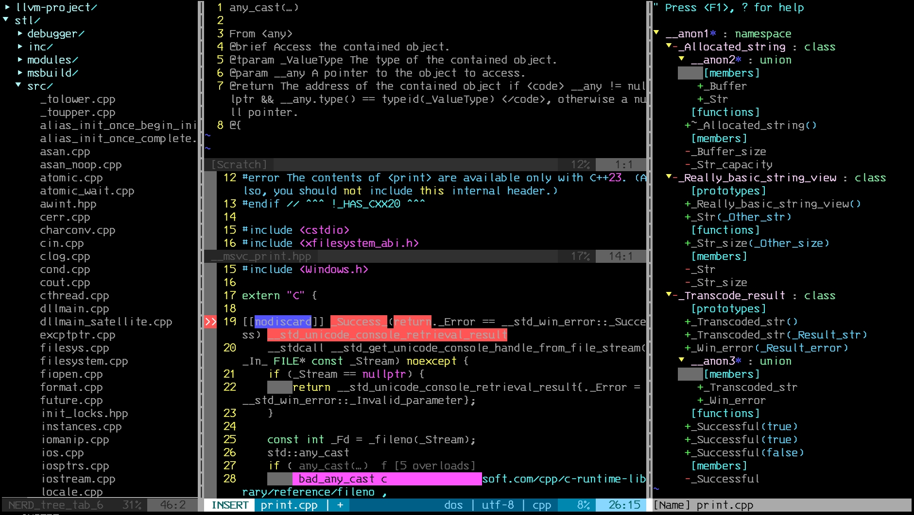
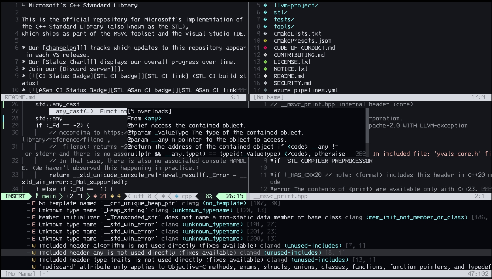
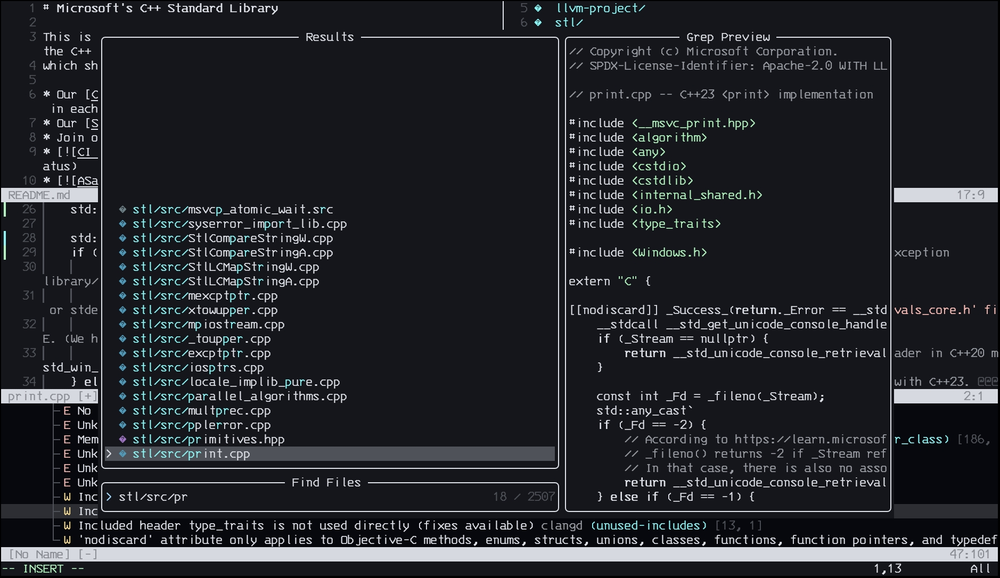

# Vimlink - My Vim and Neovim Setups      

> Copyright (c) 2015-2026, Augusto Damasceno.  
> All rights reserved.   
> SPDX-License-Identifier: BSD-2-Clause

## Contact
> [augustodamasceno@protonmail.com](mailto:augustodamasceno@protonmail.com)

## Vim


## Neovim  



## Installation  
> Unix-like systems only.  

By default `install.sh` sets up both **Vim** and **Neovim**.  
Pass `--vim` or `--neovim` to install only one:  

```shell
# Install both (default)
bash install.sh

# Install only Vim
bash install.sh --vim

# Install only Neovim
bash install.sh --neovim
```

* An English dictionary from [Hunspell English Dictionaries](http://wordlist.aspell.net/hunspell-readme/)  
  (MIT-like license; BSD license for the affix file) is shared by both setups.  
* **Vim**: backs up your existing `.vimrc` and installs the new one.  
* **Neovim**: backs up your existing `init.lua`, copies `nvim/init.lua` to  
  `~/.config/nvim/init.lua`, and bootstraps [lazy.nvim](https://github.com/folke/lazy.nvim)  
  on the first launch.  

## Files
```shell
# Shared
~/.dic/en_US.dic

# Vim
~/.vimrc
~/.vimrc_backup_*

# Neovim
~/.config/nvim/init.lua
~/.config/nvim/init.lua.backup_*
~/.local/share/nvim/lazy/          # lazy.nvim + all plugins
```  

## Vim Dependencies  

`install.sh` automatically installs all dependencies listed below. For manual installation instructions of any individual package, see [notes.md](https://github.com/augustodamasceno/vimlink/blob/main/notes.md).

| Dependency | Description |
|---|---|
| **vim-nox** | Vim build compiled with Python 3 support, required by YouCompleteMe |
| **wget** | Downloads vim-plug and the English dictionary |
| **unzip** | Extracts the downloaded dictionary archive |
| **python3** | Runtime for YouCompleteMe and its build system |
| **python3-dev** | Python 3 C headers needed to compile the YouCompleteMe native extension |
| **cmake** | Build system used to compile the ycmd server |
| **build-essential** | GCC/G++ compiler and make, required to build ycmd |
| **clangd** | Language server providing C and C++ completions via YouCompleteMe |
| **Exuberant Ctags** | Generates tag files for code navigation (`:tags` command) |
| **vim-plug** | Vim plugin manager, fetches and manages all Vim plugins |
| **YouCompleteMe** | Fast code completion engine for C, C++ and Python |

## Vim Features and commands 

* See line numbers  
* Highlight syntax  
* Tabs are four columns wide  
* Each indentation level is one tab  
* Do not change tab for spaces 
* Equal size windows 
* English Dictionary completion  
* Colors optimized for dark background  
* Backspace works over indentation, line breaks and insert start  
* Linter status shown in the status line (errors and warnings count)  
* ALE lints on save, not on buffer enter  
* Commands  
    * `ctabs` : convert tabs into 4 spaces  
    * `Rbeg` \<NUM-CHARS\> \<REPLACE-WITH\> : Replace beginning characters of a selection 
    * `tags` : Show/Hide Tags  
    * `Ycmoff` : Enable/Disable YouCompleteMe  
    * Control + b : change buffer files   
    * Control + e : Go to the next error  
    * Control + i : Indent all lines  
    * Control + t : Open NERDTree file explorer   
* Plugins
    * vim-scripts/vim-asm: Adds support for assembly language syntax highlighting and features in Vim.  
    * dense-analysis/ale: ALE (Asynchronous Lint Engine) is a plugin for real-time syntax checking and linting.  
    * majutsushi/tagbar: Tagbar provides an overview of the structure of code files, displaying tags in a sidebar.  
    * preservim/nerdtree: NERDTree is a file explorer tool that adds a navigable tree structure for files and directories.  
    * ycm-core/YouCompleteMe: YouCompleteMe is a fast, powerful code completion engine for Vim.  
    * itchyny/lightline.vim: Lightline is a lightweight status line/tabline for Vim, offering a visually appealing and informative status bar.  
    * nathanaelkane/vim-indent-guides: Vim Indent Guides visually displays text indentation levels with subtly highlighted guides.  

## Neovim Dependencies  

`install.sh` automatically installs all dependencies listed below. For manual installation instructions of any individual package, see [notes.md](https://github.com/augustodamasceno/vimlink/blob/main/notes.md).

| Dependency | Description |
|---|---|
| **neovim** ≥ 0.10 | Neovim runtime |
| **git** | Required by lazy.nvim to clone plugins |
| **wget / curl** | Downloads the English dictionary |
| **unzip** | Extracts the dictionary archive |
| **Node.js** | Required by the GitHub Copilot plugin |
| **ripgrep** | Fast grep backend for Telescope `live_grep` |
| **clangd** | Language server for C and C++ |
| **pyright** | Language server for Python |
| **cmake-language-server** | Language server for CMake files |
| **black** | Python formatter used by conform.nvim |
| **clang-format** | C/C++ formatter used by conform.nvim |
| **debugpy** | Python debug adapter for nvim-dap |
| **gdb** | C/C++ debugger for nvim-dap |
| **lazy.nvim** | Plugin manager — self-bootstrapped from `init.lua` on first launch |

## Neovim Features and Commands  

* Line numbers  
* Syntax highlighting via Treesitter (C, C++, Python, Lua, Bash, CMake, Make)  
* 4-column tabs, no tab-to-space conversion  
* Dark background optimised colours  
* English dictionary word completion (`<C-x><C-k>`)  
* LSP-powered completions, diagnostics and formatting (clangd, pyright, cmake-language-server)  
* Format on save (clang-format for C/C++, black for Python)  
* Git signs in the gutter (added / changed / removed hunks)  
* Automatic bracket and quote pairing  
* Visual indent guides  
* Commands  
    * `Ctabs` : convert tabs to 4 spaces  
    * `<C-b>` : next buffer  
    * `<C-e>` : go to next diagnostic  
    * `<C-i>` : re-indent all lines  
* Keymaps (leader key: `<Space>`)  
    * `<leader>ff` : find files (Telescope)  
    * `<leader>fg` : live grep (Telescope)  
    * `<leader>fb` : browse buffers (Telescope)  
    * `<leader>fh` : help tags (Telescope)  
    * `<leader>fd` : search diagnostics (Telescope)  
    * `<leader>xx` : toggle diagnostics list (Trouble)  
    * `<leader>xX` : toggle buffer diagnostics (Trouble)  
    * `<leader>ha` : add file to Harpoon list  
    * `<leader>hh` : toggle Harpoon quick menu  
    * `<leader>h1`–`<leader>h4` : jump to Harpoon file 1–4  
    * `<leader>db` : toggle breakpoint (nvim-dap)  
    * `<leader>dc` : continue (nvim-dap)  
    * `<leader>ds` : step over (nvim-dap)  
    * `<leader>di` : step into (nvim-dap)  
    * `<leader>do` : step out (nvim-dap)  
    * `<leader>du` : toggle DAP UI (nvim-dap-ui)  
    * `<leader>rn` : rename symbol (LSP)  
    * `<leader>ca` : code action (LSP)  
    * `<leader>f`  : format buffer (LSP)  
    * `<leader>gs` : stage hunk (Gitsigns)  
    * `<leader>gu` : undo staged hunk (Gitsigns)  
    * `<leader>gp` : preview hunk (Gitsigns)  
    * `<leader>gb` : blame line (Gitsigns)  
    * `gd` : go to definition (LSP)  
    * `gD` : go to declaration (LSP)  
    * `gr` : go to references (LSP)  
    * `gi` : go to implementation (LSP)  
    * `K`  : hover documentation (LSP)  
    * `-`  : open Oil file manager  
    * `<M-CR>` : accept Copilot suggestion  
    * `<M-]>` / `<M-[>` : next / previous Copilot suggestion  
* Plugins  
    * **folke/lazy.nvim**: Fast, feature-rich plugin manager for Neovim.  
    * **nvim-treesitter/nvim-treesitter**: Incremental parsing for accurate syntax highlighting and code analysis.  
    * **neovim/nvim-lspconfig**: Pre-configured LSP client setup for common language servers.  
    * **hrsh7th/nvim-cmp**: Completion engine with LSP, buffer, and path sources.  
    * **p00f/clangd_extensions.nvim**: Enhanced clangd features (inlay hints, type hierarchy).  
    * **mfussenegger/nvim-dap**: Debug Adapter Protocol client for interactive debugging.  
    * **rcarriga/nvim-dap-ui**: Graphical UI panels for nvim-dap (variables, watches, call stack).  
    * **stevearc/oil.nvim**: File manager that lets you edit directories like text buffers.  
    * **ThePrimeagen/harpoon**: Quick-access bookmarks for up to four frequently used files.  
    * **Civitasv/cmake-tools.nvim**: CMake workflow integration — build, run, debug from Neovim.  
    * **folke/trouble.nvim**: Structured list of diagnostics, references, quickfix, and location lists.  
    * **zbirenbaum/copilot.lua**: Lua-native GitHub Copilot integration with inline suggestions.  
    * **nvim-telescope/telescope.nvim**: Extensible fuzzy finder for files, grep, buffers, and more.  
    * **lewis6991/gitsigns.nvim**: Inline git hunk indicators and stage/blame shortcuts.  
    * **nvim-lualine/lualine.nvim**: Lightweight, configurable status line.  
    * **windwp/nvim-autopairs**: Automatic bracket/quote pairing.  
    * **lukas-reineke/indent-blankline.nvim**: Visual indent guides.  
    * **stevearc/conform.nvim**: Fast formatter dispatcher (clang-format, black, stylua).  

## Cheat Sheets and references in the file [notes.md](https://github.com/augustodamasceno/vimlink/blob/main/notes.md) 
